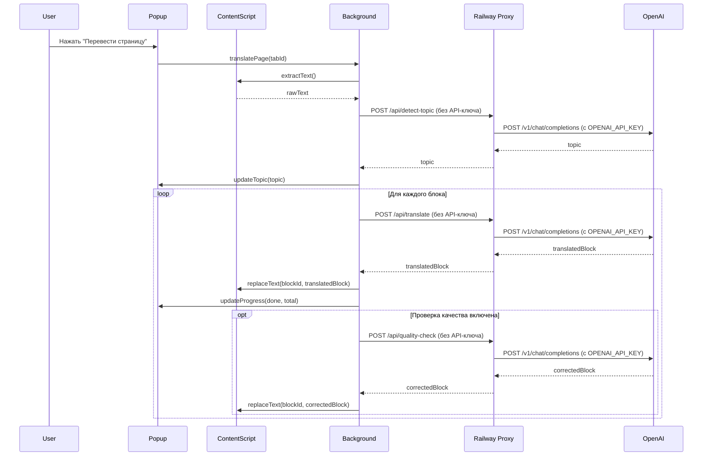

# Технический дизайн: Finnish-to-Russian Translator

## Обзор

Браузерное расширение (Chrome/Firefox) для автоматического перевода финских веб-страниц на русский язык с использованием OpenAI ChatGPT API. Расширение состоит из четырёх основных компонентов: Content Script (внедряется в страницу), Background Service Worker (управляет API-запросами), UI (Popup + Options Page) и Proxy Server (Node.js + Express, развёрнутый на Railway).

API-ключ OpenAI хранится исключительно в переменных окружения Railway — расширение не хранит и не знает ключ. Пользователь указывает только URL Railway-прокси в настройках расширения.

Процесс перевода включает три последовательных этапа:
1. Определение тематики страницы (1 API-запрос через прокси)
2. Перевод блоков текста (N API-запросов через прокси, по одному на блок)
3. Опциональная проверка качества (N API-запросов через прокси)



---

## Архитектура

### Структура файлов расширения

```
extension/
├── manifest.json          # Манифест расширения (Manifest V3)
├── background/
│   ├── service-worker.js  # Точка входа Background Script
│   ├── api-client.js      # Модуль взаимодействия с Proxy Server
│   ├── queue.js           # Очередь API-запросов с rate limiting
│   └── topic-detector.js  # Определение тематики страницы
├── content/
│   ├── content-script.js  # Внедряемый скрипт
│   ├── dom-walker.js      # Обход DOM и извлечение текстовых узлов
│   └── text-replacer.js   # Замена текста в DOM
├── popup/
│   ├── popup.html
│   ├── popup.js
│   └── popup.css
└── options/
    ├── options.html
    ├── options.js
    └── options.css
```

### Структура файлов Proxy Server

```
server/
├── index.ts          # Express сервер
├── routes/
│   └── proxy.ts      # Маршруты проксирования
├── package.json
├── tsconfig.json
└── railway.toml      # Конфигурация Railway
```

### Коммуникация между компонентами

Компоненты расширения общаются через Chrome Extension Messaging API:

```
Popup ←→ Background (chrome.runtime.sendMessage / chrome.runtime.onMessage)
ContentScript ←→ Background (chrome.tabs.sendMessage / chrome.runtime.sendMessage)
```

Background Service Worker отправляет запросы к Railway Proxy, который проксирует их в OpenAI API:

```
Background → Railway Proxy (fetch к proxyUrl из настроек)
Railway Proxy → OpenAI API (fetch с OPENAI_API_KEY из env)
```

Manifest V3 требует использования Service Worker вместо Background Page. Service Worker может быть выгружен браузером — состояние хранится в `chrome.storage.session`.

---

## Компоненты и интерфейсы

### Background Service Worker

Центральный координатор. Управляет жизненным циклом перевода, очередью запросов и состоянием.

**Обработчики сообщений:**

```typescript
// Входящие сообщения от Popup и ContentScript
type IncomingMessage =
  | { type: 'TRANSLATE_PAGE'; tabId: number }
  | { type: 'TOGGLE_AUTO_TRANSLATE'; enabled: boolean }
  | { type: 'CHANGE_STYLE'; style: TranslationStyle }
  | { type: 'TEXT_EXTRACTED'; tabId: number; text: string; blocks: TextBlock[] }

// Исходящие сообщения в ContentScript и Popup
type OutgoingMessage =
  | { type: 'EXTRACT_TEXT' }
  | { type: 'REPLACE_BLOCK'; blockId: string; text: string }
  | { type: 'PROGRESS_UPDATE'; done: number; total: number; topic: Topic }
  | { type: 'TRANSLATION_ERROR'; message: string; openOptions?: boolean }
```

### API Client

Модуль для взаимодействия с Railway Proxy Server.

```typescript
interface ApiClient {
  detectTopic(text: string): Promise<Topic>
  translateBlock(block: string, systemPrompt: string): Promise<string>
  qualityCheck(original: string, translated: string): Promise<string>
}
```

Все методы используют `fetch` к эндпоинтам Railway Proxy (`proxyUrl` из настроек):
- `POST {proxyUrl}/api/detect-topic`
- `POST {proxyUrl}/api/translate`
- `POST {proxyUrl}/api/quality-check`

API-ключ расширению неизвестен — он хранится только в переменных окружения Railway.

### Request Queue

Очередь с контролем частоты запросов и логикой повторных попыток.

```typescript
interface RequestQueue {
  enqueue<T>(request: () => Promise<T>): Promise<T>
  pause(durationMs: number): void
  getStatus(): QueueStatus
}
```

Реализует экспоненциальный backoff: 1с → 2с → 4с (максимум 3 попытки). При получении 429 приостанавливает очередь на 60 секунд.

### Content Script

```typescript
interface ContentScriptAPI {
  extractText(): { rawText: string; blocks: TextBlock[] }
  replaceBlock(blockId: string, translatedText: string): void
  restoreOriginal(): void
  showTranslation(): void
}
```

### DOM Walker

Обходит DOM в глубину, собирает текстовые узлы (исключая `<script>`, `<style>`, `<noscript>`). Пропускает узлы с менее чем 3 символами.

### Text Replacer

Хранит оригинальные текстовые узлы в `Map<string, Text>` (blockId → TextNode). Заменяет `nodeValue` текстового узла без изменения структуры DOM.

### Popup UI

Три кнопки + индикатор прогресса + отображение тематики. Выбор стиля перевода (radio buttons).

### Options Page

Поля: URL Railway-прокси (text input), выбор модели (select), лимит запросов/мин (number input), переключатель проверки качества.

### Proxy Server (Railway)

Node.js + Express сервер, развёрнутый на Railway. Принимает запросы от расширения, добавляет API-ключ из переменной окружения `OPENAI_API_KEY` и проксирует запросы к OpenAI API.

**Эндпоинты:**

```
POST /api/detect-topic   — определение тематики
POST /api/translate      — перевод блока текста
POST /api/quality-check  — проверка качества перевода
```

**Конфигурация CORS:** разрешены только запросы с origin `chrome-extension://` (расширение). Все остальные origin отклоняются.

**Переменные окружения Railway:**
- `OPENAI_API_KEY` — секретный ключ OpenAI API (пользователь задаёт в Railway Dashboard)

---

## Модели данных

### Перечисления

```typescript
type Topic =
  | 'медицина'
  | 'юриспруденция'
  | 'финансы'
  | 'техника'
  | 'IT'
  | 'бытовая'
  | 'деловая'
  | 'разговорная'

type TranslationStyle = 'буквальный' | 'литературный' | 'нейтральный'

type GptModel = 'gpt-4o' | 'gpt-4o-mini' | 'gpt-3.5-turbo'
```

### TextBlock

```typescript
interface TextBlock {
  id: string           // UUID блока
  text: string         // Оригинальный текст (2000–4000 символов)
  nodeIds: string[]    // Идентификаторы DOM-узлов, входящих в блок
  translated?: string  // Переведённый текст (после получения)
  corrected?: string   // Скорректированный текст (после quality check)
}
```

### TranslationState

```typescript
interface TranslationState {
  tabId: number
  topic: Topic | null
  style: TranslationStyle
  blocks: TextBlock[]
  currentBlockIndex: number
  status: 'idle' | 'detecting' | 'translating' | 'done' | 'error'
  errorMessage?: string
}
```

### ExtensionSettings

```typescript
interface ExtensionSettings {
  proxyUrl: string         // URL Railway-прокси (например: https://my-proxy.railway.app)
  model: GptModel          // По умолчанию: 'gpt-4o-mini'
  requestsPerMinute: number // По умолчанию: 20
  qualityCheckEnabled: boolean // По умолчанию: false
  translationStyle: TranslationStyle // По умолчанию: 'нейтральный'
  autoTranslate: boolean   // По умолчанию: false
}
```

### SystemPrompt

Системный промпт формируется динамически:

```typescript
function buildSystemPrompt(topic: Topic, style: TranslationStyle): string {
  const topicInstructions: Record<Topic, string> = {
    'медицина': 'Используй медицинскую терминологию. Сохраняй точность клинических терминов.',
    'юриспруденция': 'Используй юридическую терминологию. Сохраняй точность правовых формулировок.',
    'финансы': 'Используй финансовую терминологию. Сохраняй точность числовых данных.',
    'техника': 'Используй техническую терминологию. Сохраняй названия деталей и процессов.',
    'IT': 'Используй IT-терминологию. Технические термины можно оставлять на английском.',
    'бытовая': 'Используй разговорный стиль. Перевод должен звучать естественно.',
    'деловая': 'Используй деловой стиль. Сохраняй формальность и профессионализм.',
    'разговорная': 'Используй разговорный стиль. Передавай интонацию и эмоции.',
  }
  const styleInstructions: Record<TranslationStyle, string> = {
    'буквальный': 'Переводи максимально близко к оригиналу, сохраняя структуру предложений.',
    'литературный': 'Переводи свободно, адаптируя текст для естественного звучания на русском.',
    'нейтральный': 'Переводи точно, сохраняя смысл, с естественным русским языком.',
  }
  return `Ты профессиональный переводчик с финского на русский язык.
${topicInstructions[topic]}
${styleInstructions[style]}
Переводи только предоставленный текст. Не добавляй комментариев и пояснений.`
}
```

---

## Обработка ошибок

### Стратегия повторных попыток

| Ошибка | Действие |
|--------|----------|
| Сетевая ошибка | Повтор до 3 раз: 1с, 2с, 4с |
| HTTP 401 от прокси | Уведомление + открыть Options Page (неверный OPENAI_API_KEY на Railway) |
| HTTP 429 | Пауза 60с + уведомление |
| HTTP 5xx | Повтор до 3 раз: 1с, 2с, 4с |
| Все попытки исчерпаны | Уведомление об ошибке в Popup |

### Журналирование

Все ошибки логируются через `console.error` в формате:
```
[FinnishTranslator] ERROR {timestamp} requestId={id} code={code} message={message}
```

### Отсутствие Proxy URL

При попытке перевода без сохранённого `proxyUrl` Popup отображает сообщение с кнопкой "Открыть настройки".

---


## Свойства корректности

*Свойство — это характеристика или поведение, которое должно выполняться при всех допустимых выполнениях системы. По сути, это формальное утверждение о том, что система должна делать. Свойства служат мостом между читаемыми человеком спецификациями и машинно-верифицируемыми гарантиями корректности.*

### Свойство 1: Извлечение текста из DOM

*Для любого* DOM-дерева, содержащего текстовые узлы, функция `extractText()` должна возвращать непустой результат, содержащий текстовое содержимое всех видимых текстовых узлов страницы.

**Validates: Requirements 1.1**

---

### Свойство 2: Нормализация тематики

*Для любой* строки, возвращённой ChatGPT API в ответ на запрос определения тематики, функция нормализации должна возвращать одну из восьми допустимых тематик. Для строк, не совпадающих ни с одной тематикой (включая пустую строку, числа, произвольный текст), результатом должна быть тематика "бытовая".

**Validates: Requirements 1.3, 1.4**

---

### Свойство 3: Системный промпт для всех комбинаций тематики и стиля

*Для любой* комбинации из восьми тематик и трёх стилей перевода функция `buildSystemPrompt(topic, style)` должна возвращать строку, содержащую инструкции, специфичные для данной тематики, и инструкции, специфичные для данного стиля.

**Validates: Requirements 1.5, 3.2**

---

### Свойство 4: Размер блоков текста

*Для любого* текста длиной более 2000 символов функция разбивки на блоки должна возвращать блоки, каждый из которых содержит от 2000 до 4000 символов (за исключением последнего блока, который может быть меньше 2000 символов). Границы блоков должны совпадать с границами предложений.

**Validates: Requirements 2.1**

---

### Свойство 5: Сохранение HTML-структуры при замене текста

*Для любого* DOM-дерева и любого переведённого текста, после вызова `replaceBlock(blockId, translatedText)` количество HTML-тегов, их атрибуты и вложенность должны оставаться идентичными исходному DOM. Изменяться должны только значения текстовых узлов.

**Validates: Requirements 2.3, 8.2**

---

### Свойство 6: Корректность индикатора прогресса

*Для любой* последовательности переведённых блоков, после обработки N блоков из M общих, индикатор прогресса в Popup должен отображать значение N/M, где N не превышает M.

**Validates: Requirements 2.5**

---

### Свойство 7: Изменение стиля применяется к следующим блокам

*Для любой* последовательности блоков, если стиль перевода изменяется после обработки блока с индексом K, то все блоки с индексом > K должны использовать новый стиль, а блоки с индексом ≤ K должны сохранять старый стиль.

**Validates: Requirements 3.4**

---

### Свойство 8: Финальный текст при включённой проверке качества

*Для любого* блока текста при включённой проверке качества, текст, отображаемый в DOM после завершения обработки блока, должен быть результатом запроса проверки качества, а не предварительного перевода.

**Validates: Requirements 4.2, 4.3**

---

### Свойство 9: Round-trip восстановления оригинала

*Для любого* DOM-дерева, после выполнения перевода и последующего вызова `restoreOriginal()`, текстовое содержимое всех текстовых узлов должно быть идентично содержимому до начала перевода.

**Validates: Requirements 5.4, 8.4**

---

### Свойство 10: Кэширование перевода

*Для любой* страницы с завершённым переводом, переключение между оригиналом и переводом (вызовы `restoreOriginal()` и `showTranslation()`) не должно инициировать новые запросы к ChatGPT API.

**Validates: Requirements 5.5**

---

### Свойство 11: Round-trip сохранения Proxy URL

*Для любой* строки URL Railway-прокси, после сохранения через `saveProxyUrl(url)` и последующего чтения через `loadProxyUrl()`, возвращаемое значение должно быть идентично сохранённому.

**Validates: Requirements 6.4**

---

### Свойство 12: Повторные попытки при сетевой ошибке

*Для любого* API-запроса, завершающегося сетевой ошибкой, система должна выполнить ровно 3 попытки с задержками не менее 1с, 2с и 4с соответственно перед тем, как сообщить об ошибке.

**Validates: Requirements 7.1**

---

### Свойство 13: Журналирование ошибок API

*Для любой* ошибки API (сетевой или HTTP), запись в журнале должна содержать код ошибки, временную метку и идентификатор запроса.

**Validates: Requirements 7.5**

---

### Свойство 14: Исключение script/style из извлечения

*Для любого* DOM-дерева, содержащего теги `<script>`, `<style>` или `<noscript>`, функция `extractText()` не должна включать содержимое этих тегов в извлечённый текст.

**Validates: Requirements 8.1**

---

## Стратегия тестирования

### Двойной подход к тестированию

Используются два взаимодополняющих вида тестов:

- **Unit-тесты** — проверяют конкретные примеры, граничные случаи и условия ошибок
- **Property-based тесты** — проверяют универсальные свойства на большом количестве сгенерированных входных данных

### Unit-тесты

Фокус unit-тестов:
- Конкретные примеры корректного поведения (структура API-запроса, обработка кодов ошибок 401/429)
- Интеграционные точки между компонентами (Popup → Background → ContentScript)
- Граничные случаи: пустой DOM, текст менее 3 символов, последний блок меньше 2000 символов
- Начальное состояние: стиль "нейтральный" по умолчанию, отсутствие proxyUrl

Примеры unit-тестов:
- Проверка структуры запроса к OpenAI API (наличие модели, системного промпта, текста)
- Поведение при HTTP 401: уведомление + открытие Options Page
- Поведение при HTTP 429: пауза 60с + уведомление
- Наличие трёх кнопок в Popup UI
- Наличие переключателя проверки качества на Options Page
- Отображение сообщения при отсутствии proxyUrl

### Property-based тесты

**Библиотека**: [fast-check](https://github.com/dubzzz/fast-check) (JavaScript/TypeScript)

Каждый property-based тест должен выполняться минимум **100 итераций**.

Каждый тест должен содержать комментарий-тег в формате:
```
// Feature: finnish-to-russian-translator, Property {N}: {краткое описание свойства}
```

Соответствие свойств и тестов (каждое свойство реализуется одним property-based тестом):

| Свойство | Тест | Тег |
|----------|------|-----|
| P1: Извлечение текста | `fc.property(arbitraryDOM, dom => extractText(dom).length > 0)` | `Property 1: text extraction` |
| P2: Нормализация тематики | `fc.property(fc.string(), s => VALID_TOPICS.includes(normalizeTopic(s)))` | `Property 2: topic normalization` |
| P3: Системный промпт | `fc.property(arbitraryTopic, arbitraryStyle, (t, s) => buildSystemPrompt(t,s).includes(topicKeyword(t)))` | `Property 3: system prompt coverage` |
| P4: Размер блоков | `fc.property(arbitraryLongText, text => splitIntoBlocks(text).every(b => b.length <= 4000))` | `Property 4: block size invariant` |
| P5: Сохранение HTML | `fc.property(arbitraryDOM, arbitraryText, (dom, t) => htmlStructureEqual(dom, replaceBlock(dom, t)))` | `Property 5: HTML structure preservation` |
| P6: Прогресс | `fc.property(fc.nat(100), n => progressAfter(n).done === n)` | `Property 6: progress indicator` |
| P7: Изменение стиля | `fc.property(arbitraryBlocks, arbitraryStyle, (blocks, style) => blocksAfterStyleChange(blocks, style))` | `Property 7: style change applies forward` |
| P8: Quality check финальный текст | `fc.property(arbitraryBlock, block => finalText(block, true) === qualityChecked(block))` | `Property 8: quality check final text` |
| P9: Round-trip оригинала | `fc.property(arbitraryDOM, dom => textEqual(dom, restoreOriginal(translate(dom))))` | `Property 9: original restore round-trip` |
| P10: Кэширование | `fc.property(arbitraryPage, page => apiCallCount(toggleTwice(page)) === 0)` | `Property 10: translation caching` |
| P11: Round-trip proxyUrl | `fc.property(fc.webUrl(), url => loadProxyUrl(saveProxyUrl(url)) === url)` | `Property 11: proxy url round-trip` |
| P12: Повторные попытки | `fc.property(arbitraryRequest, req => retryCount(req, networkError) === 3)` | `Property 12: retry on network error` |
| P13: Журналирование | `fc.property(arbitraryApiError, err => logEntry(err).includes(err.code))` | `Property 13: error logging` |
| P14: Исключение script/style | `fc.property(arbitraryDOMWithScripts, dom => !extractText(dom).includes(scriptContent(dom)))` | `Property 14: script/style exclusion` |

### Конфигурация fast-check

```typescript
import fc from 'fast-check'

// Минимальное количество итераций для каждого теста
fc.configureGlobal({ numRuns: 100 })
```
